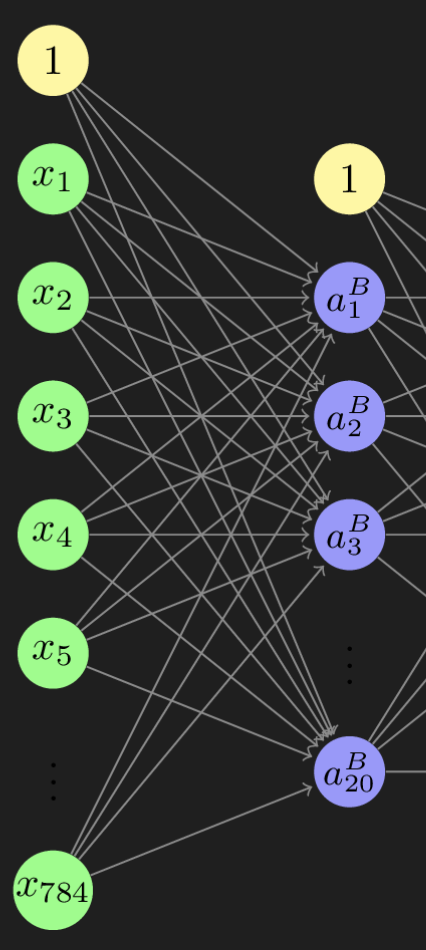
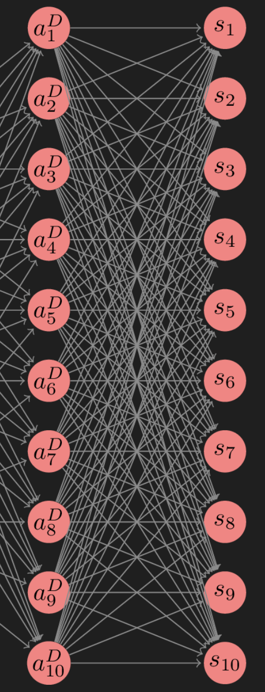

# Machine Learning Framework
This framework can be used to build and train a neural network that contains classic layers with the sigmoid function as the activation function and softmax layers.
The framework consists of three main classes or interfaces: the layer interface respectively layer classes, the class for the neural network model and the class for the training model.

## Architecture

* NNLayerInterface
  * ClassicLayer
  * SoftmaxLayer
  

* NeuronalNetworkModel <- contains list of layers 


* OptimizerInterface
  * GradientDescentOptimizer


* CostFunctionInterface
  * CrossEntropy
  * MeanSquaredError
  * CategoricalCrossEntropy


* TrainingModel <- contains NeuronalNetworkModel, CostFunctionInterface, OptimizerInterface

## Import
To use the entire framework, simply import the TrainingModel.py file. If you want to use the hyperparameter testing you should also import HyperparameterTesting.py. All other files are already imported with the training model this file.

```python
from src.machine_learning_framework.TrainingModel import *
import HyperparameterTesting.py
```

## Building and training a model
Creating a model is a three-step process. First, you define the layers that you want to use in your model. 
Then you define the model and finally the training model. 
### Defining the layers
There are two types of layers. 

<u>The ClassicLayer:</u>  
This layer contains a number of neurons defined in "output". Each neuron receives some input values (how many is defined in the constructor). It uses its weights to determine the z-value.
It uses the sigmoid activation function to calculate its output value. 
<div style="text-align:center;">
    <figure>
        
        <figcaption>Image of a ClassicLayer with 784 inputs named X and 20 neurones.</figcaption>
    </figure>
</div>

<u>The SoftmaxLayer:</u>  
This layer contains a number of neurons defined in "output". Each neuron receives some input values (how many is defined in the constructor). It determines the z value with its weights. It has no activation function. Instead, all the outputs of its neurons are processed further in the softmax function. 
The output of the layer is the result of the softmax function.


<div style="text-align:center;">
    <figure>
        
        <figcaption>Image of a softmax layer with 10 neurones.</figcaption>
    </figure>
</div>

The layers have some getter and setter methods. They also have a forward and backward function, which is used in the forward and backward propagation of the neuronal network model. 
These two are not intended for use by a user.
All activation functions are defined in ActivationFunctions.py.
Following example shows how to define the layers.
```python
classic_layer = ClassicLayer(input_size=784, output_size=20)
softmax_layer = SoftmaxLayer(input_size=20, output_size=10)
```

### Defining a neuronal network model
Out of a list of layers, we can define a neuronal network model. We can define a neural network model from a list of layers. The input of a layer must match the output of the previous layer, or in the case of the first layer, the network input!

```python
neuronal_network = NeuronalNetworkModel([classic_layer, softmax_layer])
```
The neuronal network class has three important member functions. One determining the result of a forward propagation, one the result of a
backward propagation and a classification function. 

## Defining the training model

The training model class consists of a neural network model, a cost function and an optimizer. The cost function is only used to determine the error. 
The back propagation always uses the categorical cross entropy. The optimizer is used to update the weights of the neural network model layer.

### The cost function interface and classes

The cost function classes inherit from an interface class. The classes calculate the error from the predictions of the model and the ground truth and possibly the weights and a lambda. There are three different error classes: MeanSquaredError(), CrossEntropy() and CategoricalCrossEntropy(). These classes are mainly used in the training model and the user does not have to use the member functions himself.

Example of use. Predictions are the results of a neural network and targets are the target values. Both are np.ndarrays containing integers:

```python
cross_entropy = CrossEntropy()
cross_entropy.calculate(predictions=predictions, targets=targets, weights=[], lam=0)
```
### The optimizer interface and class
The optimizer classes inherit from an interface class. With the help of learning_rate, gradient_weights and gradient_bias, it optimizes the weights of the layers. Only the gradient descent optimizer class is implemented.
These classes are mainly used in the training model and the user does not have to use the member functions himself.
### The training model

Example of the creation of a training model:
```python
training_model = TrainingModel(neuronal_network, CategoricalCrossEntropy(), GradientDescentOptimizer())
```
## Training a model

The train function trains the model. In addition to the training data and the truth, it receives the number of iterations, the learning rate, lamda, the absolut path to a directory, the three booleans, whether it should display a graphic of the error after every 10 iterations, whether it should output some metrics after each iteration and whether it should save the weights as a pkl file. The abs_path is a path to the directory in which the weights are to be saved. 
In addition, the model name is requested for the file name of the weights.

Example of the training method. training_truth is an array of integers that define the target classes, training_data is the data used for training:

```python
training_model.train(training_data, training_truth, epoch=100, learning_rate=0.1, lam=0.1, abs_path="", graphics=True, prints=True, save_weights=False, model_name="example")
```
This class also has a "backpropagation" function. This function runs through the model backwards and determines the derivatives of the weights. This function is not intended for the user, but for the training method.

## Classify with the trained model

After training the model, we can now classify some data, where validation_data is the data to be classified.

```python
predictions = neuronal_network.classification(validation_data)
```

## Metrics

Several functions are defined in Metrics.py to determine the f1 score or the accuracy of individual classes or the entire model. All require only the predicted values and the truth.

Example where validation_truth are the target classes in the form of an np-ndarray containing integers:
```python
Metrics.f1_score_average(predictions, validation_truth)
```

## Hyperparameter testing

The file HyperparameterTesting.py contains the function train_multiple_hyperparameters(...). This function can be used to train and validate different models on the same data and validate them. At the end you know which hyperparameters are the best.

Example of use:

```python
input_data # the training data
truth_data # the truth of the training data
validation_data # the validation data
validation_truth # the truth of the validation data
layer # List with lists. Each contained list contains only integers that define the layers and the layer size of a model.  
# The length of each list describes the number of layers of the model, the respective entry the number of neurons per layer. 
epoch # List with integer values. Each integer describes the number of iterations with which the model belonging to the index is to be trained.
learning_rate # List of floating point numbers. Each floating point number describes the learning rate with which the model belonging to the index is to be trained.
lam # List with floating point numbers. Each float describes the lamda with which the model belonging to the index is to be trained.
# the length of layer, epoch, learning_rate and lam has to be the same!!

costfunction # Cost function to be used for all models
optimizer # oprimizer to be used for all models.
abs_path # path to the directory, where the resulting textfile with all metrics as well as the curves of the error should be saved

HyperparameterTesting.train_multiple_hyperparameters(input_data, truth_data, validation_data, validation_truth, layer, epoch,
                                   learning_rate, lam, abs_path, costfunction = CategoricalCrossEntropy(), optimizer = GradientDescentOptimizer()))
```
The function writes some metrics to a text file, and at the end you can see which model performed best in the validation data.

If you want to do a randomized search, you can also use the function randomized_search(). This function gets lists of possible parameters for all hyperparameters and creates random combinations of them.

Exampl usage:
```python
input_data # the training data
truth_data # the truth of the training data
validation_data # the validation data
validation_truth # the truth of the validation data
layer = [2, 3, 4] # possible numbers of layers
neuron = [10, 20, 40, 80] # possible numbers of neurons per layer. Ec´very layer has the same numer of neurones.
epoch = [3] # possible numbers of epochs
learning_rate = [0.1, 0.2, 0.4] # possible learning rates
lam = [0.001, 0.01, 0.1] # possible lamdas
abs_path = os.path.join(os.getcwd(), 'resource/testing/') # path to the directory, where the resulting textfile with all metrics as well as the curves of the error should be saved

HyperparameterTesting.randomized_search(input_data, truth_data, validation_data, validation_truth,, layer, neuron, learning_rate, epoch, lam, 50, 4, abs_path)


```